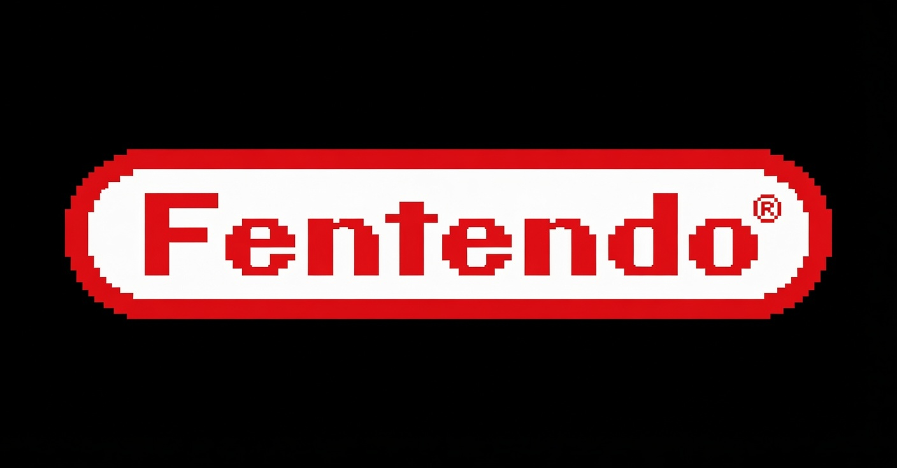

# Fentendo

**Fentendo Co, LTD**

---

## About This Repository

This repository serves as the official documentation and policy portal for the Fentendo Entertainment System.

It provides authorized developers and users with access to:

- Official policies and legal agreements
- System version information and firmware manifests
- Technical specifications for integration with Fentendo platforms
- Server reference materials for game clients

---

## 📜 Official Policies

- **[End User License Agreement (EULA)](POLICIES/EULA.md)**

These documents govern the use of all Fentendo hardware, firmware, and software. Users and developers are required to comply with these terms.

---

## 🛠️ Developer Resources

This repository contains technical documentation intended for licensed developers creating software for the Fentendo Entertainment System, including:

- API specifications for version checking and license validation
- Firmware update protocols
- Integration guidelines

Access to certain resources may be restricted to authorized partners.

---

## Project Information

- **Current Version**: 1.0.0
- **Status**: Active Development
- **Last Updated**: June 2026

---

## Legal Notice

Fentendo Co, LTD is a fictional entity created for creative, educational, and parody purposes. This project has **zero affiliation** with Nintendo Co., Ltd. or any other real-world corporation.

All original software, firmware, documentation, and assets in this repository are protected by copyright. Fentendo Co, LTD retains all intellectual property rights.

---

## License

All original content in this repository is licensed under the [Creative Commons Attribution-NonCommercial 4.0 International (CC BY-NC 4.0)](https://creativecommons.org/licenses/by-nc/4.0/) license unless otherwise stated.

---

© 2026 Fentendo Co, LTD. All Rights Reserved.
